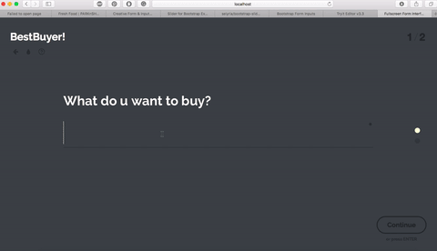
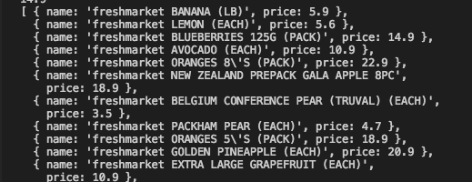

# TheBestBuyer Demo
This is a hackathon(hackUST) project (http://hack.ust.hk/hack2017/)  
 
The data set we have published is an extraction of all the goods and prices of the products within two of the most competitive supermarkets in Hong Kong: Parknshop and Wellcome. We have successfully scraped the information from their official websites which increases the reliability and validity of the data, and thus increasing the accuracy of our software. Additionally, we have established a software which self-scrapes the data from the ParknShop supermarkets in a given time period, to ensure our data is always up to date, avoiding any minor change such as discounts to certain products. 
After the extraction, we filtered out the incomplete data and provide a score for each of the prices extracted. The grading system of the scores is made linearly, which is used later on in our final output of the software. This system also self-corrects the data, making our grading system up to date as well. 

## Demo1: User interface 
   

## Demo2: Get real time data scraped from parknshop website 
   

## Demo3: Google map demo 

### Using google map api to calculate the distance between shops and generate the rankings according to the user's preference on the product price and the time required to buy it (traveling time).   

## Screeshot of our json output

